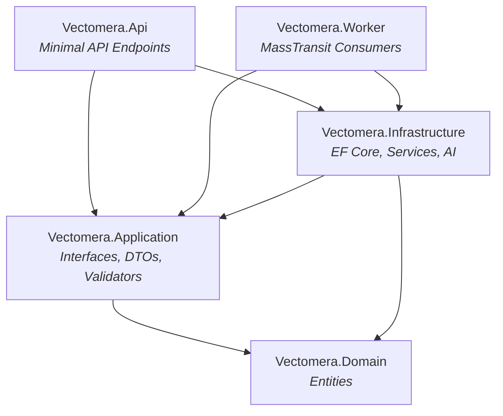
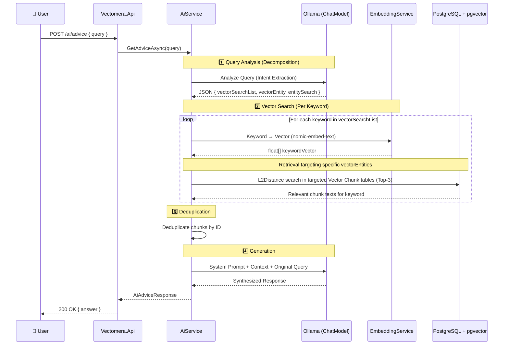
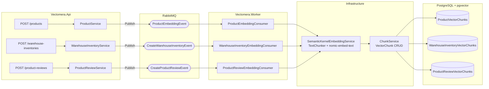
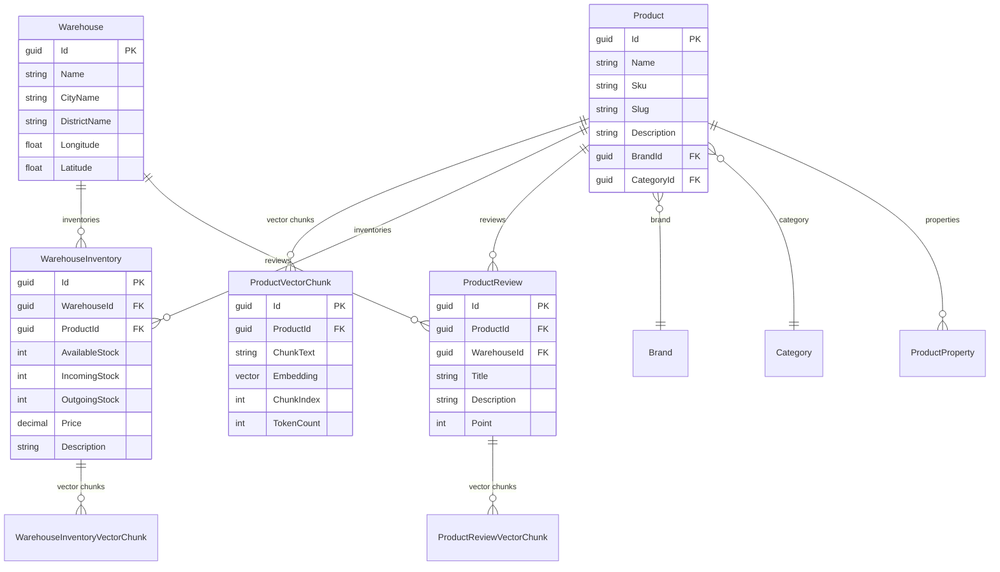

# ☀️ Vectomera — AI-Powered Inventory & Product Intelligence Platform

<p align="center">
  
  
  
  
  
</p>

**Vectomera** is an AI-powered e-commerce and inventory management platform that unifies product catalogs, warehouse inventory management, and product reviews. Powered by a robust **RAG (Retrieval-Augmented Generation)** infrastructure, it enables **semantic search** and **intelligent data analysis** across all domain entities.

---

## 🏗️ Architecture Overview

The project is built upon **Clean Architecture** principles and orchestrated using **.NET Aspire**.

```
Vectomera.sln
├── Vectomera.AppHost          → .NET Aspire Orchestrator (Api + Worker)
├── Vectomera.Api              → REST API (Minimal API Endpoints)
├── Vectomera.Application      → Business rules, Interfaces, DTOs, Validations
├── Vectomera.Domain           → Entity models, BaseEntity
├── Vectomera.Infrastructure   → EF Core, Services, Ollama/SK Integrations
├── Vectomera.Worker           → Background consumers (MassTransit)
├── Vectomera.ServiceDefaults  → Shared Aspire configurations
└── docker-compose.yml         → PostgreSQL (pgvector) + RabbitMQ
```

### Layer Dependency Flow



---

## 🤖 RAG & Query Decomposition Pipeline

The core of Vectomera's AI capabilities lies within its **RAG** architecture, now supercharged with a **Query Decomposition** step. Before hitting the vector database, the system analyzes complex user queries, breaks them down into sub-queries, and targets specific database entities for highly precise search results.



### Query Analysis (Decomposition)
The user's original query is first evaluated by the LLM acting as a "Query Analyser". The LLM breaks down the request into actionable components:
- **`vectorSearchList`**: Meaningful sub-queries or keywords optimized for vector search (e.g., `["shipping issue", "product defect"]`).
- **`vectorEntity`**: Targeted vector chunk tables needed to answer the query (e.g., `["ProductReviewVectorChunk", "ProductVectorChunk"]`).
- **`entitySearch`**: Direct domain entity mappings.

This structure allows the vector search algorithm to iterate over multiple sub-queries, dynamically searching only the relevant tables, which drastically improves search accuracy and avoids context dilution.

### Vector Search Tables

The query vector is searched across the following **3 distinct VectorChunk** tables using `L2Distance` (Euclidean distance), retrieving the top **3 nearest records** from each:

| Table | Source Data | Description |
|---|---|---|
| `ProductVectorChunks` | Product Descriptions | Semantic chunks based on product details |
| `WarehouseInventoryVectorChunks` | Inventory Descriptions | Semantic chunks based on stock and warehouse details |
| `ProductReviewVectorChunks` | Product Reviews | Semantic chunks based on user rating, title, and comments |

---

## ⚙️ Embedding & Chunking Flow

Whenever new data is created (product, inventory, or review), **embedding** and **chunking** processes are automatically triggered in the background.



### Process Details

1. **API** saves the data and publishes an event to the RabbitMQ queue using `MassTransit (Publish)`.
2. A Consumer in the **Worker** listens to this event.
3. **SemanticKernelEmbeddingService** splits the text into paragraphs (chunks) using `TextChunker`, and then converts each chunk into a vector array (`float[]`) using Ollama's `nomic-embed-text` model.
4. **ChunkService** saves the generated vector chunks (`VectorChunk`) into the corresponding `pgvector` columns in PostgreSQL.

> **Review Embedding Format:**
> Before chunking, product reviews are formatted as follows:
> `"Point: {Point}/5. Title: {Title}. Comment: {Description}"`

---

## 🗄️ Domain Model



---

## 🛣️ API Endpoints

### Product Management (`/products`)
| Method | Endpoint | Description |
|---|---|---|
| `POST` | `/products` | Creates a new product and publishes an embedding event |
| `PUT` | `/products/{id}` | Updates an existing product |
| `GET` | `/products` | Lists products |

### Warehouse Inventory Management (`/warehouse-inventories`)
| Method | Endpoint | Description |
|---|---|---|
| `POST` | `/warehouse-inventories` | **Bulk** creates inventory records (Supports Partial Success) |
| `GET` | `/warehouse-inventories` | Lists inventory information |

### Product Reviews (`/product-reviews`)
| Method | Endpoint | Description |
|---|---|---|
| `POST` | `/product-reviews` | **Bulk** creates product review records |

### AI Assistant (`/ai`)
| Method | Endpoint | Description |
|---|---|---|
| `POST` | `/ai/advice` | RAG-based semantic Q&A. Scans all VectorChunk tables |

> 📌 All endpoints are accessible and testable via the **Swagger UI**.

---

## 🧰 Tech Stack

| Technology | Purpose |
|---|---|
| **.NET 9** | Framework (API, Worker, AppHost) |
| **.NET Aspire** | Service orchestration and observability |
| **Minimal API** | Endpoint definitions |
| **Entity Framework Core 9** | ORM & database access |
| **PostgreSQL 16 + pgvector** | Relational data + vector storage |
| **RabbitMQ** | Message queue (event-driven architecture) |
| **MassTransit** | Messaging infrastructure |
| **Ollama** | Local LLM execution (Gemma3, nomic-embed-text) |
| **Semantic Kernel** | AI orchestration, TextChunker, Embedding services |
| **OllamaSharp** | Ollama API client |
| **Pgvector.EntityFrameworkCore** | Vector operations (L2Distance) via EF Core |
| **FluentValidation** | Request validation |

---

## 🚀 Getting Started

### Prerequisites

- [.NET 9 SDK](https://dotnet.microsoft.com/download/dotnet/9.0)
- [Docker Desktop](https://www.docker.com/products/docker-desktop/)
- [Ollama](https://ollama.com/)

### 1. Start Infrastructure Services

```bash
docker-compose up -d
```

This command will start the following services:

| Service | Port | Description |
|---|---|---|
| PostgreSQL (pgvector) | `5432` | Database (`vectomeradb`) |
| RabbitMQ | `5672` / `15672` | Message queue / Management UI |

### 2. Download Ollama Models

```bash
ollama pull nomic-embed-text
ollama pull gemma3:4b
```

| Model | Size | Usage |
|---|---|---|
| `nomic-embed-text` | ~274 MB | Text embedding (vector generation) |
| `gemma3:4b` | ~3.3 GB | Chat / Q&A (LLM) |

### 3. Run the Application

```bash
# Using .NET Aspire (Starts Api + Worker together)
dotnet run --project Vectomera.AppHost

# Or run them separately
dotnet run --project Vectomera.Api
dotnet run --project Vectomera.Worker
```

### 4. Swagger UI

Once the application is running, you can access the Swagger interface at:

```
http://localhost:<port>/swagger
```

---

## ⚙️ Configuration

You can customize the following settings in the `appsettings.json` file:

```json
{
  "OllamaOptions": {
    "Endpoint": "http://localhost:11434",
    "EmbeddingModel": "nomic-embed-text",
    "ChatModel": "gemma3:4b"
  }
}
```

---

## 📄 License

This project is for private use.

