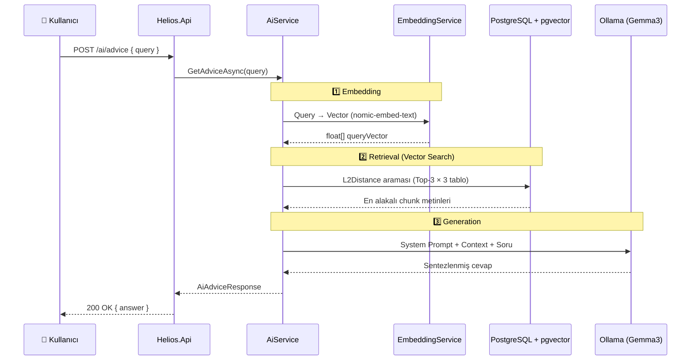
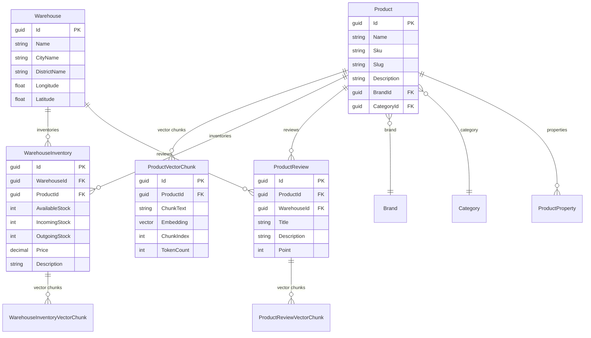

# ☀️ Helios — AI-Powered Inventory & Product Intelligence Platform

<p align="center">
  
  
  
  
  
</p>

**Helios**, ürün kataloğu, depo envanter yönetimi ve ürün yorumlarını bir arada sunan, yapay zeka destekli bir e-ticaret / stok yönetim platformudur. Sistemin kalbi olan **RAG (Retrieval-Augmented Generation)** altyapısı sayesinde tüm veriler üzerinde **anlamsal arama** ve **akıllı analiz** yapılabilir.

---

## 🏗️ Mimari Genel Bakış

Proje, **Clean Architecture** prensipleri ve **.NET Aspire** orkestrasyonu üzerine inşa edilmiştir.

```
Helios.sln
├── Helios.AppHost          → .NET Aspire Orchestrator (Api + Worker)
├── Helios.Api              → REST API (Minimal API Endpoints)
├── Helios.Application      → İş kuralları, Arayüzler, DTO'lar, Validasyonlar
├── Helios.Domain           → Entity modelleri, BaseEntity
├── Helios.Infrastructure   → EF Core, Servisler, Ollama/SK entegrasyonu
├── Helios.Worker           → Arka plan tüketicileri (MassTransit Consumers)
├── Helios.ServiceDefaults  → Ortak Aspire yapılandırması
└── docker-compose.yml      → PostgreSQL (pgvector) + RabbitMQ
```

### Katman Bağımlılık Akışı


---

## 🤖 RAG (Retrieval-Augmented Generation) Pipeline

Helios'un AI yeteneklerinin temelinde **RAG** mimarisi bulunur. Bu akış, kullanıcı sorusunu anlamsal olarak en alakalı veritabanı kayıtlarıyla birleştirerek LLM'e gönderir ve bağlam odaklı, hallüsinasyon riski düşük cevaplar üretir.



### Vektör Arama Tabloları

Sorgu vektörü, aşağıdaki **3 farklı VectorChunk** tablosunda `L2Distance` (Öklid mesafesi) ile aranır ve her birinden en yakın **3 kayıt** getirilir:

| Tablo | Kaynak Veri | Açıklama |
|---|---|---|
| `ProductVectorChunks` | Ürün açıklamaları | Ürün detay bilgilerine dayalı semantik parçalar |
| `WarehouseInventoryVectorChunks` | Envanter açıklamaları | Stok ve depo bilgilerine dayalı semantik parçalar |
| `ProductReviewVectorChunks` | Ürün yorumları | Kullanıcı puanı, başlığı ve yorumuna dayalı semantik parçalar |

---

## ⚙️ Embedding & Chunking Akışı

Veri oluşturma anında (ürün, envanter, yorum) otomatik olarak arka planda **embedding** ve **chunking** işlemleri tetiklenir.


### Süreç Detayı

1. **API** üzerinden veri kaydedilir ve `MassTransit (Publish)` ile RabbitMQ kuyruğuna bir event gönderilir.
2. **Worker** tarafındaki Consumer bu event'i dinler.
3. **SemanticKernelEmbeddingService** metni `TextChunker` ile paragraflara böler (chunk), ardından Ollama'nın `nomic-embed-text` modeli ile her bir chunk'ı bir vektör dizisine (`float[]`) dönüştürür.
4. **ChunkService** oluşturulan vektör parçalarını (`VectorChunk`) PostgreSQL'deki `pgvector` sütununa kaydeder.

> **Yorum Embedding Formatı:**
> Ürün yorumları chunking öncesi şu formatta birleştirilir:
> `"Puan: {Point}/5. Başlık: {Title}. Yorum: {Description}"`

---

## 🗄️ Domain Modeli



---

## 🛣️ API Endpoint'leri

### Ürün Yönetimi (`/products`)
| Method | Endpoint | Açıklama |
|---|---|---|
| `POST` | `/products` | Yeni ürün oluşturur, ardından embedding event'i publish eder |
| `PUT` | `/products/{id}` | Mevcut ürünü günceller |
| `GET` | `/products` | Ürünleri listeler |

### Depo Envanter Yönetimi (`/warehouse-inventories`)
| Method | Endpoint | Açıklama |
|---|---|---|
| `POST` | `/warehouse-inventories` | **Toplu (Bulk)** envanter kaydı oluşturur (Partial Success destekli) |
| `GET` | `/warehouse-inventories` | Envanter bilgilerini listeler |

### Ürün Yorumları (`/product-reviews`)
| Method | Endpoint | Açıklama |
|---|---|---|
| `POST` | `/product-reviews` | **Toplu (Bulk)** ürün yorumu kaydı oluşturur |

### Yapay Zeka Asistanı (`/ai`)
| Method | Endpoint | Açıklama |
|---|---|---|
| `POST` | `/ai/advice` | RAG tabanlı anlamsal soru-cevap. Tüm VectorChunk tablolarını tarar |

> 📌 Tüm endpoint'ler **Swagger UI** üzerinden erişilebilir ve test edilebilir.

---

## 🧰 Teknoloji Yığını

| Teknoloji | Kullanım Alanı |
|---|---|
| **.NET 9** | Framework (API, Worker, AppHost) |
| **.NET Aspire** | Servis orkestrasyonu ve gözlemlenebilirlik |
| **Minimal API** | Endpoint tanımlamaları |
| **Entity Framework Core 9** | ORM & veritabanı erişimi |
| **PostgreSQL 16 + pgvector** | İlişkisel veri + vektör depolama |
| **RabbitMQ** | Mesaj kuyruğu (event-driven) |
| **MassTransit** | Mesajlaşma altyapısı |
| **Ollama** | Lokal LLM çalıştırma (Gemma3, nomic-embed-text) |
| **Semantic Kernel** | AI orkestrasyon, TextChunker, Embedding servisleri |
| **OllamaSharp** | Ollama API istemcisi |
| **Pgvector.EntityFrameworkCore** | EF Core üzerinden vektör işlemleri (L2Distance) |
| **FluentValidation** | İstek doğrulama |

---

## 🚀 Başlarken

### Ön Koşullar

- [.NET 9 SDK](https://dotnet.microsoft.com/download/dotnet/9.0)
- [Docker Desktop](https://www.docker.com/products/docker-desktop/)
- [Ollama](https://ollama.com/)

### 1. Altyapı Servislerini Başlatın

```bash
docker-compose up -d
```

Bu komut aşağıdaki servisleri ayağa kaldıracaktır:

| Servis | Port | Açıklama |
|---|---|---|
| PostgreSQL (pgvector) | `5432` | Veritabanı (`heliosdb`) |
| RabbitMQ | `5672` / `15672` | Mesaj kuyruğu / Yönetim paneli |

### 2. Ollama Modellerini İndirin

```bash
ollama pull nomic-embed-text
ollama pull gemma3:4b
```

| Model | Boyut | Kullanım |
|---|---|---|
| `nomic-embed-text` | ~274 MB | Metin embedding (vektör oluşturma) |
| `gemma3:4b` | ~3.3 GB | Chat / Soru-cevap (LLM) |

### 3. Uygulamayı Çalıştırın

```bash
# .NET Aspire ile (Api + Worker birlikte)
dotnet run --project Helios.AppHost

# veya ayrı ayrı
dotnet run --project Helios.Api
dotnet run --project Helios.Worker
```

### 4. Swagger UI

Uygulama çalıştıktan sonra Swagger arayüzüne erişebilirsiniz:

```
http://localhost:<port>/swagger
```

---

## 📁 Yapılandırma

`appsettings.json` içinde aşağıdaki ayarları özelleştirebilirsiniz:

```json
{
  "OllamaOptions": {
    "Endpoint": "http://localhost:11434",
    "EmbeddingModel": "nomic-embed-text",
    "ChatModel": "gemma3:4b"
  }
}
```

---

## 📄 Lisans

Bu proje özel kullanım içindir.
